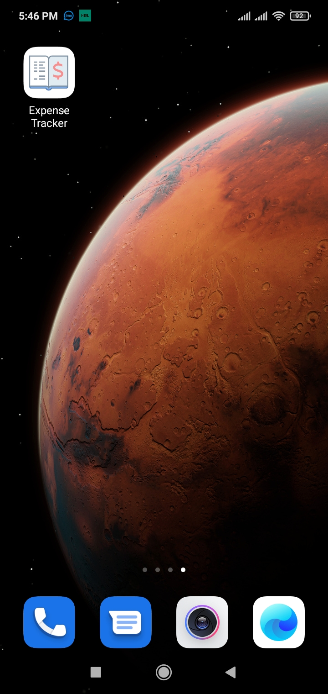
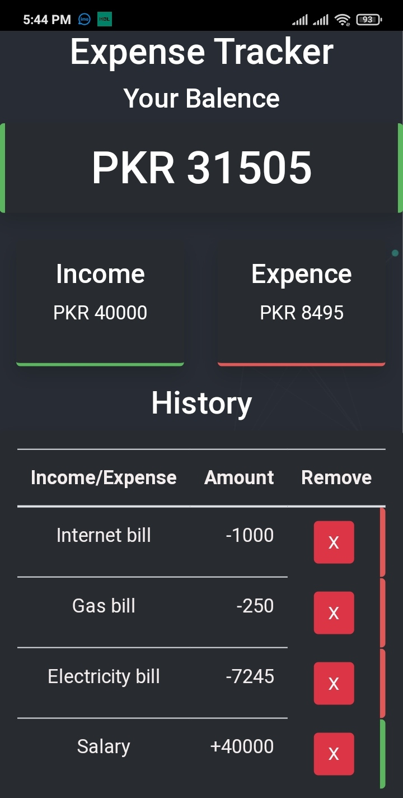

# Expense Tracker (PWA)

[Click here to test](https://umer2001-expense-tracker-pwa.surge.sh/)

It is expense tracker app built on **Reactjs** <code></code>

# Features

- **PWA** (installable)
- **Storage** (It can persist transections after refresh as well as restart of device or app)
- **Fast** (its fast & and provides experiance like native app when installed)
- **Cross Platform** (you can install it on any device with a modern browser)

## Screenshots

   
